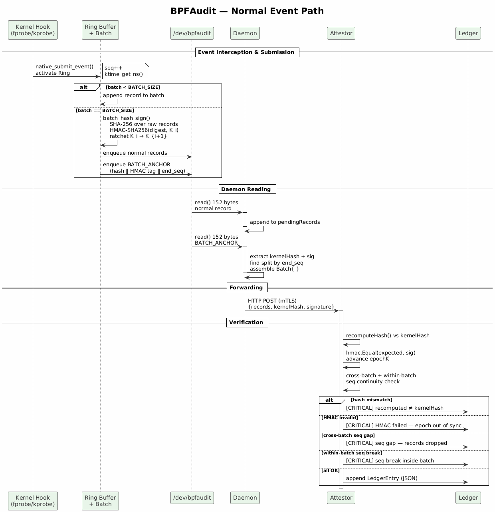
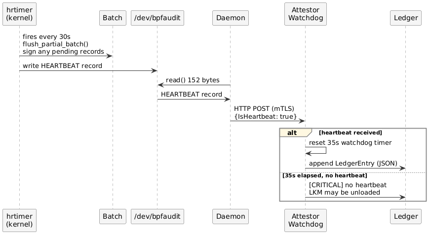

# BPFLedger

Loadable kernel module that records every eBPF and cBPF lifecycle event in a tamper-evident, cryptographically chained ledger, exposed via `/dev/bpfaudit`.

**Goal:** append-only, forensic-grade audit trail of every BPF program from load to memory release — with per-batch SHA-256 + HMAC-SHA256 authentication, forward-secret key ratcheting, and heartbeat-driven integrity pulses.

---

## Repository layout

```
bpfledger/
├── Makefile
├── README.md
├── src/
│   ├── bpfledger_main.c        — probes, char device, module init/exit
│   ├── bpfledger_ring.c        — ring buffer, batch accumulation, anchor FIFO
│   ├── bpfaudit_heartbeat.c    — hrtimer (30 s), partial-batch flush, hb_slot
│   └── bpfaudit_crypto.c       — SHA-256 batch hash, HMAC-SHA256, key ratchet
└── include/
    ├── bpfledger.h             — audit_record ABI (152 bytes, packed)
    ├── bpfledger_ring.h        — ring constants, extern state, submit API
    ├── bpfaudit_heartbeat.h    — bpf_ring_ctx, init/exit declarations
    └── bpfaudit_crypto.h       — batch_crypto_record, crypto API
```

---

## How it works

Every kernel probe calls `emit_prog_event()` → `native_submit_event()`:

1. A 152-byte `audit_record` is stamped with a monotonic sequence number and `ktime_get_ns()` timestamp, then written into a 65536-slot vmalloc ring.
2. Non-heartbeat records accumulate in a 16-record batch buffer.
3. When the batch is full, `batch_hash_sign()` computes **SHA-256** over the raw bytes of all 16 records, then **HMAC-SHA256** of that digest under the current epoch key `K_i`. A `BATCH_ANCHOR` record carrying both values is pushed to an anchor FIFO and delivered to readers.
4. `K_i` is immediately zeroed; `K_{i+1} = SHA-256(K_i)`, compromise of a later key cannot forge past batches.
5. Every 30 seconds the heartbeat timer flushes any partial batch first, then writes a `HEARTBEAT` record so readers can detect stalls.

```
probe fires
  └─ emit_prog_event()
       └─ native_submit_event()
            ├─ seq++, timestamp_ns = ktime_get_ns()
            ├─ ring[seq & RING_MASK] = rec
            ├─ events_batch[batch_count++] = rec
            └─ if batch_count == 16:
                 ├─ SHA-256(batch[0..15])
                 ├─ HMAC-SHA256(digest, K_i)
                 ├─ K_i zeroed, K_{i+1} = SHA-256(K_i)
                 └─ BATCH_ANCHOR → anchor_fifo → /dev/bpfaudit
```

---

## Kernel hooks

### eBPF — fprobe

| Hook | Kernel symbol | Event |
|---|---|---|
| LOAD | `bpf_prog_new_fd` | Program passes verifier, FD created |
| ATTACH | `bpf_link_settle` | `BPF_LINK_CREATE` path commit |
| ATTACH | `perf_event_set_bpf_prog` | perf `ioctl` path |
| ATTACH | `__cgroup_bpf_attach` | Legacy `BPF_PROG_ATTACH` cgroup path |
| PIN | `bpf_obj_pin_user` | Pinned to `/sys/fs/bpf/`, path recorded |
| DETACH | `bpf_link_free` | Non-perf link teardown |
| DETACH | `__cgroup_bpf_detach` | Legacy `BPF_PROG_DETACH` cgroup path |
| CLOSE | `bpf_prog_release` | FD closed, process context still valid |
| FREE | `bpf_prog_put_deferred` | Refcount zero, kworker, pre-free |

### eBPF — kprobe / kretprobe

| Hook | Kernel symbol | Event |
|---|---|---|
| ATTACH | `bpf_probe_register` | `BPF_RAW_TRACEPOINT_OPEN` path |
| DETACH | `bpf_probe_unregister` | Raw-tp FD closed |
| DETACH | `perf_event_detach_bpf_prog` | Perf detach (ioctl + link flavors) |

### cBPF — kretprobe / kprobe

| Hook | Kernel symbol | Event |
|---|---|---|
| LOAD+ATTACH | `sk_filter_trim_cap` (kretprobe) | Socket filter attached |
| FREE | `sk_filter_release` (kprobe) | Socket filter released |

Feature-probe programs (libbpf / bpftool capability detection) are silently filtered by `is_feature_probe()` and never emitted.

---

## Record format

```c
struct audit_record {          /* 152 bytes, packed */
    /* header — 24 bytes */
    u64  seq;
    u64  timestamp_ns;
    u8   event_type;           /* AUDIT_EVENT_* */
    u8   source;               /* AUDIT_SOURCE_FPROBE / KPROBE */
    u8   _hdr_pad[6];

    /* payload — 128 bytes (union) */
    union {
        struct { u32 pid, tgid, uid, gid;
                 u64 cgroup_id, pid_ns_id;
                 u32 prog_id, prog_type;
                 u8  prog_tag[8];
                 char comm[16], path[64]; 
              } ev;        /* lifecycle events */

        struct { u64 end_seq;
                 u8  batch_hash[32];   /* SHA-256 of batch   */
                 u8  batch_hmac[32];   /* HMAC-SHA256(hash, K_i) */
                 u8  _pad[56]; } anr;  /* BATCH_ANCHOR */

        u8 _raw[128];                  /* HEARTBEAT — no payload */
    } u;
};
```

Event type constants: `LOAD(0)` `ATTACH(1)` `PIN(2)` `DETACH(3)` `CLOSE(4)` `FREE(5)` `BATCH_ANCHOR(6)` `CBPF_LOAD_ATTACH(7)` `CBPF_FREE(8)` `HEARTBEAT(10)`

---

## Components

| Component | Role |
|---|---|
| `bpfledger.ko` | Probe hooks → ring → batch sign → `/dev/bpfaudit` |
| `bpfaudit-daemon` | Reads records, assembles batches on `BATCH_ANCHOR`, forwards over mTLS |
| `bpfaudit-attestor` | Recomputes hash, verifies HMAC, checks seq continuity, writes `ledger.json` |

---

## Sequence diagrams

### Full event flow



> *Diagram: probe fires → emit → ring write → batch accumulate → SHA-256 + HMAC → BATCH_ANCHOR → daemon reads → attestor verifies*

---

### Heartbeat flow



> *Diagram: hrtimer fires → flush_partial_batch → hb_slot write → smp_wmb → hb_avail=1 → wake_up → reader drains → timer restarts*

---

## Trust model

```
event captured → seq number → 16-record batch
  → SHA-256(raw bytes of all records)
  → HMAC-SHA256(digest, K_i)
  → K_i zeroed, K_{i+1} = SHA-256(K_i)
  → BATCH_ANCHOR emitted → mTLS → attestor verifies
```

Past batches stay unforgeable even after `K_i` is compromised: each key is destroyed before the next is derived.

---

## Quick start

```bash
# 1. Provision HMAC key into kernel keyring (before insmod)
dd if=/dev/urandom bs=32 count=1 2>/dev/null | xxd -p -c 256 > /tmp/audit.key
sudo keyctl add logon bpfaudit:hmac "$(cat /tmp/audit.key)" @s

# 2. Build and load
make module && make load

# 3. Run attestor
sudo AUDIT_HMAC_KEY=$(sudo xxd -p /etc/bpfaudit/hmac.key | tr -d '\n') ./attestor

# 4. Run daemon
./bpfaudit-daemon

# 5. Check kernel logs
make log
```

---

## Key lifecycle

The module fetches `bpfaudit:hmac` from the session keyring at `insmod` via `request_key()`. The key never appears in sysfs, procfs, or module parameters.

```bash
# Install key
dd if=/dev/urandom bs=32 count=1 2>/dev/null | xxd -p -c 256 \
    | sudo keyctl padd logon bpfaudit:hmac @s

# Verify
sudo keyctl show @s | grep bpfaudit

# Revoke after unload
sudo keyctl revoke $(sudo keyctl search @s logon bpfaudit:hmac)
```

> **Note:** passing `AUDIT_HMAC_KEY` as an environment variable is not production-safe — the key is visible in `/proc/<pid>/environ`. Future work: provision via Vault, TPM-sealed blob, or a dedicated key-agreement handshake over the mTLS channel.

## Debug
 
```
echo 'module bpfledger +p' | sudo tee /sys/kernel/debug/dynamic_debug/control
```

## Known limitations

- `BPF_PROG_ATTACH` sockmap path (`sock_map_prog_update`) not yet hooked
- `BPF_PROG_ATTACH` flow dissector (`skb_flow_dissector_bpf_prog_attach`) not yet hooked
- `setsockopt SO_ATTACH_BPF` (`sk_attach_bpf`) not yet hooked
- Netlink TC/XDP/LWT attach paths not yet hooked
