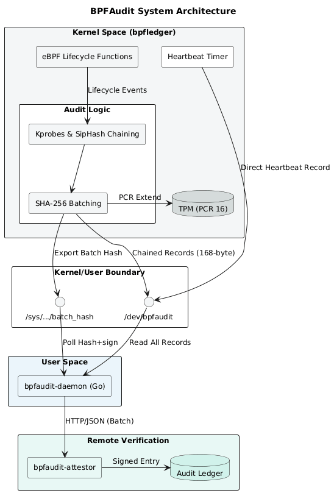

# BPFAudit / BPFLedger 

kernel–userspace system that records eBPF lifecycle events (load/unload/pin/attach/dettach) in a tamper-evident ledger using a pure kernel module based on kprobe / kretprobe.

It streams these events to userspace via a character device, where they are sent in batch to a remote attestor to verify the hash chain and batch hash with the signature.

Goal: provide reliable, append-only auditing and detection of eBPF activity at runtime 


## What it does

Every time an eBPF program is loaded, freed, pinned, or attached — the kernel module captures it, chains it cryptographically, batches 32 records, hashes the batch, extends a TPM PCR, signs the hash with a TPM-locked key, and ships everything to a remote attestor that verifies nothing was touched.


## Architecture



## Components

**bpfledger.ko** — kernel module  
Hooks LSM + kprobes, builds chained `audit_record` structs (168 bytes each), stores them in an append-only linked list, exposes records via `/dev/bpfaudit` and the batch hash via `/sys/class/bpfaudit/bpfaudit/batch_hash`.

**bpfaudit-daemon** — userspace Go daemon  
Reads records from `/dev/bpfaudit`, batches 32 at a time, signs the batch hash using the TPM (`tpm2_sign -c 0x81000003`), forwards `{records, hash, signature}` to the attestor over HTTP.

**bpfaudit-attestor** — remote Go verifier  
Receives batches, verifies sequence continuity, recomputes the SHA-256 hash from scratch, verifies the TPM signature against `pubkey.pem`, watches for heartbeat liveness. Writes every result to `ledger.json` and alerts to `alerts.log`.

---

## Trust model

```
kernel captures event
  -> SipHash chains records together
  -> SHA-256 over 32 records
  -> TPM extends PCR 16 (irreversible) (currently PCR for testing only)
  -> TPM signs hash with key at 0x81000003 (never leaves chip)
  -> attestor verifies signature with pubkey.pem
  -> sig OK + hash matches + seq unbroken = authentic
```

---

## Quick start

```bash
# load module
cd ledger && make module && make load 
``` 
- compile the daemon and run (needs TPM access)

- compile and run attestor (put pubkey.pem next to binary)

---

## TPM provisioning (once)

```bash
sudo tpm2_createprimary -C o -g sha256 -G rsa -c primary.ctx
sudo tpm2_create -C primary.ctx -g sha256 -G rsa2048:rsassa-sha256 \
     -r key.priv -u key.pub \
     --attributes "fixedtpm|fixedparent|sensitivedataorigin|userwithauth|sign|noda"
sudo tpm2_load -C primary.ctx -u key.pub -r key.priv -c key.ctx
sudo tpm2_evictcontrol -C o -c key.ctx 0x81000003
sudo tpm2_readpublic -c 0x81000003 -f pem -o pubkey.pem
```
